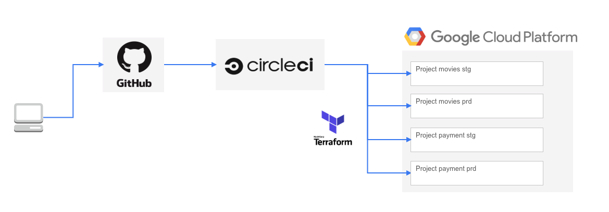

# terraform-with-circleci

| Branch                                                                                                     | Status                                                                                                                                                                                                                                                                        |
|:-----------------------------------------------------------------------------------------------------------|:------------------------------------------------------------------------------------------------------------------------------------------------------------------------------------------------------------------------------------------------------------------------------|
| [master](https://github.com/Masatoshi-Kouda/terraform-with-circleci)                                       | [](https://circleci.com/gh/Masatoshi-Kouda/terraform-with-circleci/tree/master)                                   |
| [release/movies/prd](https://github.com/Masatoshi-Kouda/terraform-with-circleci/tree/release/movies/prd)   | [](https://circleci.com/gh/Masatoshi-Kouda/terraform-with-circleci/tree/release%2Fmovies%2Fprd)   |
| [release/movies/stg](https://github.com/Masatoshi-Kouda/terraform-with-circleci/tree/release/movies/stg)   | [](https://circleci.com/gh/Masatoshi-Kouda/terraform-with-circleci/tree/release%2Fmovies%2Fstg)   |
| [release/payment/prd](https://github.com/Masatoshi-Kouda/terraform-with-circleci/tree/release/payment/prd) | [](https://circleci.com/gh/Masatoshi-Kouda/terraform-with-circleci/tree/release%2Fpayment%2Fprd) |
| [release/payment/stg](https://github.com/Masatoshi-Kouda/terraform-with-circleci/tree/release/payment/stg) | [](https://circleci.com/gh/Masatoshi-Kouda/terraform-with-circleci/tree/release%2Fpayment%2Fstg) |


## 構成



## 初期設定

- `CircleCI`, `GitHub`, `GCP`に関する事前設定等は下記を参考にしてください

[初期設定](docs/setup.md)

## Workflow

#### 1. 作業用branchを作成する

```
$ git checkout master
$ git checkout -b add-payment-pubsub
```

#### 2. 作業用branchをpushしPRを作成する

```
$ git commit -m "Add pubsub
$ git push origin add-payment-pubsub
$ hub pull-request -m "Add pubsub"
```

#### 3. レビュー後問題なければmasterへマージ

- todo

#### 4. masterブランチをリリースbranchへマージ

- `release/payment/stg` from `master`

```
$ git checkout master
$ git pull
$ hub pull-request -m "release/payment/stg" -b release/payment/stg
```
#### 5. masterブランチをリリースbranchへマージ

- `release/payment/prd` from `master`

```
$ git checkout master
$ git pull
$ hub pull-request -m "release/gmail/prd" -b release/gmail/stg
```
