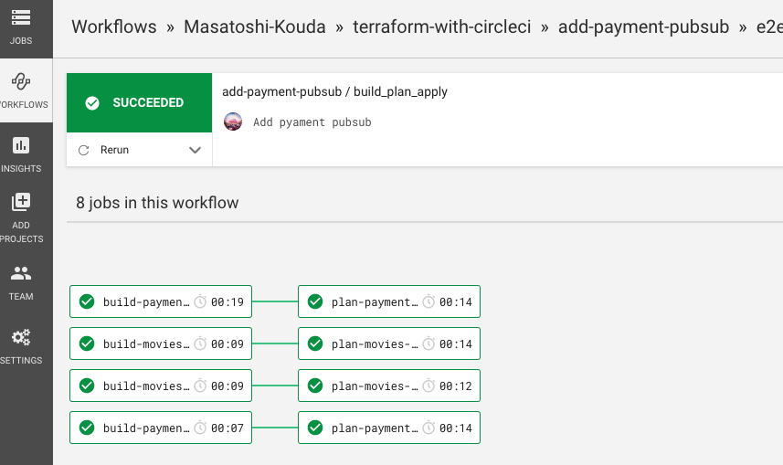
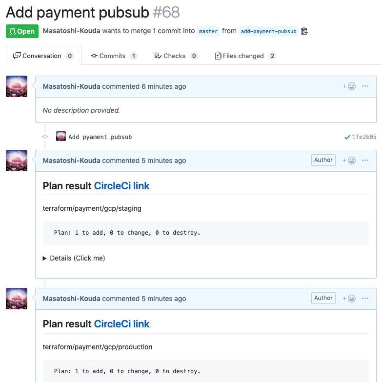
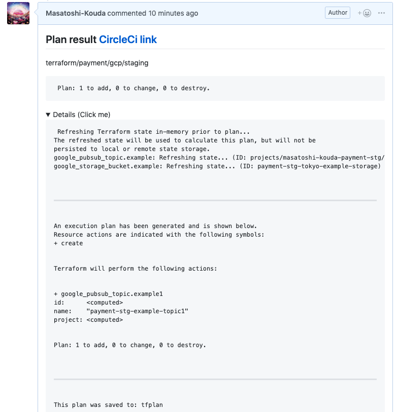
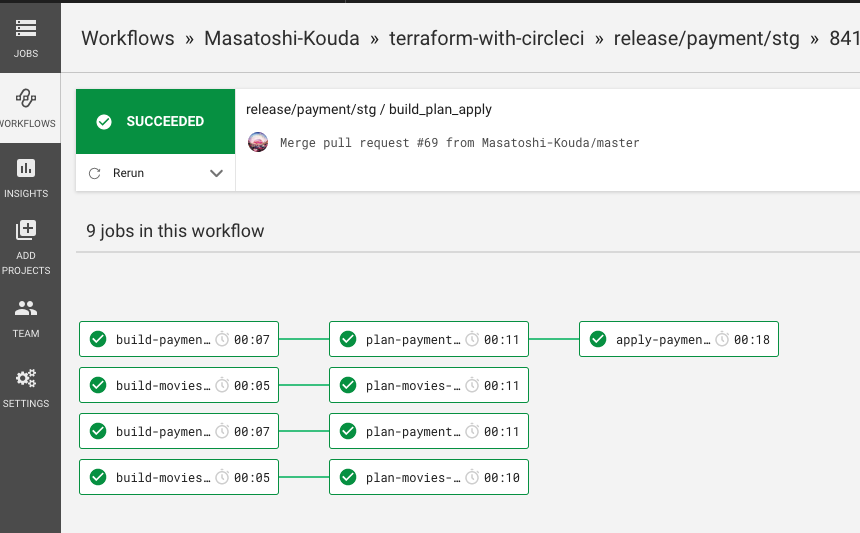
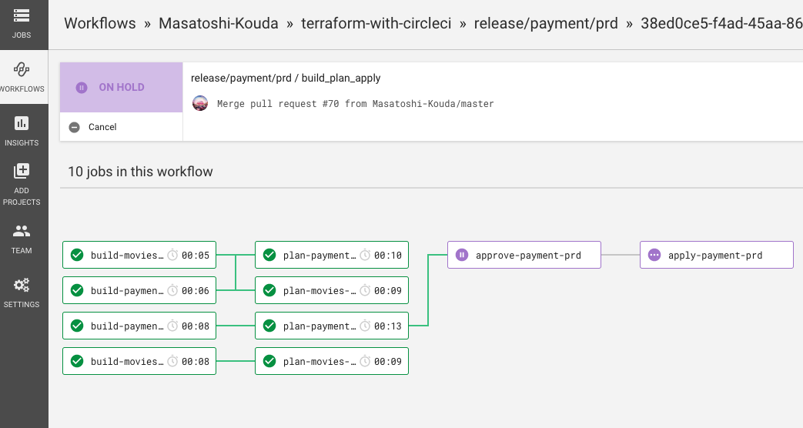
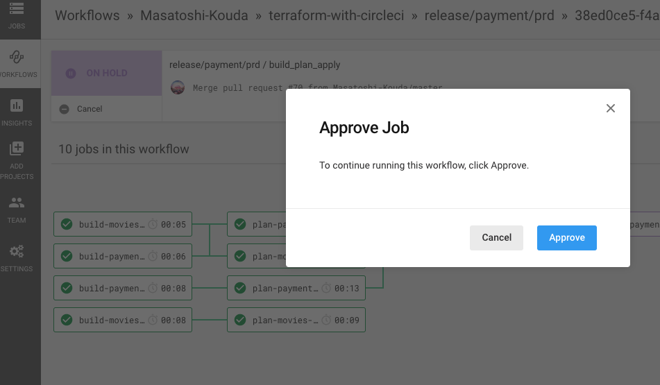
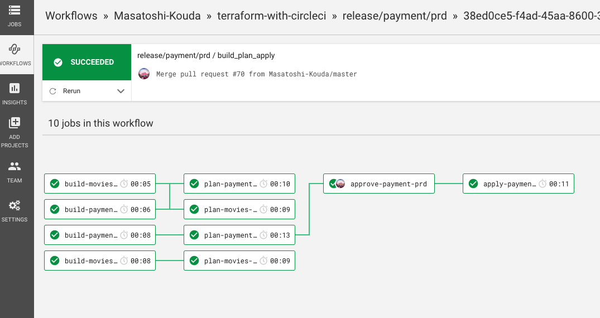

# terraform-with-circleci

| Branch                                                                                                     | Status                                                                                                                                                                                                                                                                        |
|:-----------------------------------------------------------------------------------------------------------|:------------------------------------------------------------------------------------------------------------------------------------------------------------------------------------------------------------------------------------------------------------------------------|
| [master](https://github.com/Masatoshi-Kouda/terraform-with-circleci)                                       | [](https://circleci.com/gh/Masatoshi-Kouda/terraform-with-circleci/tree/master)                                   |
| [release/movies/prd](https://github.com/Masatoshi-Kouda/terraform-with-circleci/tree/release/movies/prd)   | [](https://circleci.com/gh/Masatoshi-Kouda/terraform-with-circleci/tree/release%2Fmovies%2Fprd)   |
| [release/movies/stg](https://github.com/Masatoshi-Kouda/terraform-with-circleci/tree/release/movies/stg)   | [](https://circleci.com/gh/Masatoshi-Kouda/terraform-with-circleci/tree/release%2Fmovies%2Fstg)   |
| [release/payment/prd](https://github.com/Masatoshi-Kouda/terraform-with-circleci/tree/release/payment/prd) | [](https://circleci.com/gh/Masatoshi-Kouda/terraform-with-circleci/tree/release%2Fpayment%2Fprd) |
| [release/payment/stg](https://github.com/Masatoshi-Kouda/terraform-with-circleci/tree/release/payment/stg) | [](https://circleci.com/gh/Masatoshi-Kouda/terraform-with-circleci/tree/release%2Fpayment%2Fstg) |

## 概要

- このリポジトリは`CircleCI`を利用し、`GCP`環境上の複数`Project`へ`terraform`を実行する`CI/CD`のサンプルになります

- サンプルのプロジェクトとして`movies`サービス, `payment`サービスという名称で、それぞれで`stg`,`prd`環境が存在しており、`GCP`上で稼働中と仮定します


- 各Projectで`terraform apply`実行用にリリースブランチを作成しています

| Project Name | Environtment | Release Branch      |
|:-------------|:-------------|:--------------------|
| movies       | prd          | release/movies/prd  |
| movies       | stg          | release/movies/stg  |
| payment      | prd          | release/payment/prd |
| payment      | stg          | release/payment/stg |

## 事前準備

- `CircleCI`, `GitHub`, `GCP`に関する事前設定等は下記を参考にしてください

[初期設定](docs/setup.md)

## Workflow

- 基本的なワークフローは下記になります
- 例として`payment`プロジェクトの`stg`,`prd`環境へのリリースフローを記載します

#### 1. 作業用branchを作成

```
$ git checkout master
$ git pull origin master
$ git checkout -b add-payment-pubsub
```

#### 2. 修正が完了したら作業用branchをpushし、PRを作成

- `terraform/payment/gcp/pubsub.tf`に下記を追記します

```
resource "google_pubsub_topic" "example1" {
  name = "${var.project}-example-topic1"
}
```

- 修正後、pushしPRを作成します

```
$ git add .
$ git commit -m "Add pyament pubsub"
$ git push origin add-payment-pubsub
$ hub pull-request -m "Add payment pubsub"
```

- branchをpushすると、CicrcleCIで下記のようにJobが実行されます



- Jobをskipさせたい場合は、下記の用にコミットメッセージに`[ci skip]`を記載してください

```
$ git commit -m "[ci skip] Update README.md"
```

- しばらくすると、Jobで実行される`terraform plan`の実行結果が`tfnotify`で通知されます



#### 3. レビュー後問題なければmasterへマージ

- `terraform plan`の実行結果等、変更箇所に問題なければマージします



#### 4. staging環境へのリリース

- masterブランチをstg環境のリリースbranchへマージします
- マージすると`terraform apply`が`CircleCI`上で実行されます

```
$ git checkout master
$ git pull origin master
$ hub pull-request -m "release/payment/stg" -b release/payment/stg
```



#### 5. 本番環境へのリリース

- 同様に本番環境のリリースブランチへmasterブランチをマージすると、`terraform apply`が`CircleCI`上で実行されます

```
$ git checkout master
$ git pull origin master
$ hub pull-request -m "release/payment/prd" -b release/payment/prd
```

- 本番環境の場合、承認後に`terraform apply`が実行されます



- `Approve`をクリックし、Jobが正常に完了すると本番環境へのリリースは完了になります





