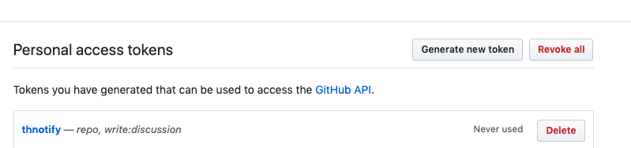
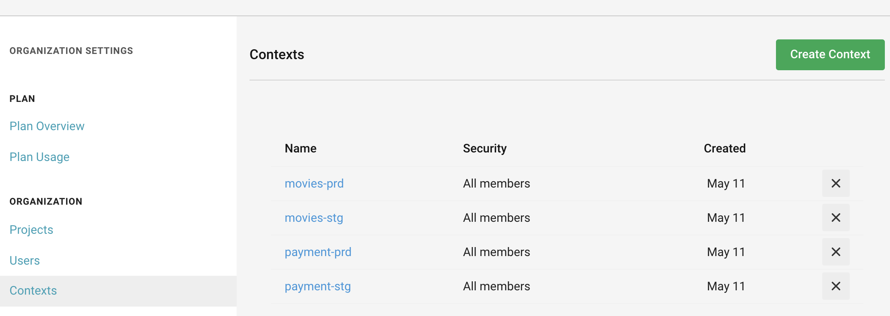
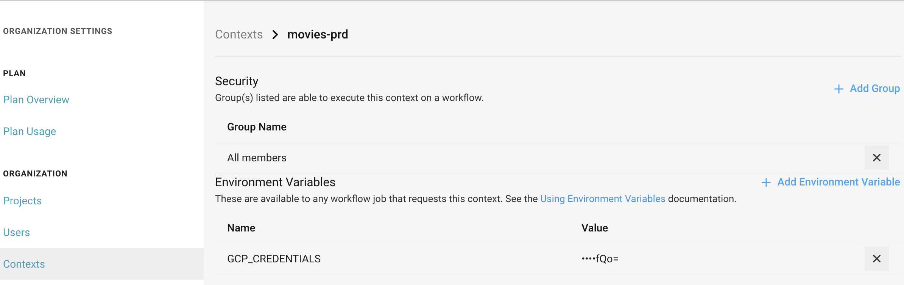
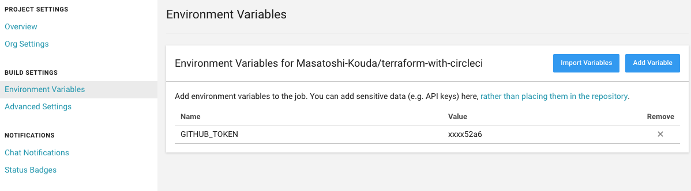

# 初期設定

## GCP

#### 1. サービスアカウントの作成

- 各プロジェクトでterraform実行用のサービスアカウントを作成します
- 役割は`編集者`を与えてください


#### 2. サービスアカウントキーの作成

- キーのタイプとして`JSON`を選択しダウンロードします
- 作成したサービスアカウントキーは、以降の手順で、CIの環境変数として使用します

## GitHub

#### 3. Personal access tokensを作成

- `GitHub`の`Personal access tokens`を発行します
- tokensの`scopes`は`repo`と`write:discussion`になります



## CircleCI

- Contextを利用して各GCPプロジェクト毎の認証情報等を登録します

#### 4. Contextの作成

- CircleCIの`Context`を利用し、`<project>-<env>`で`Context`を作成します



#### 5. 各Context毎にEnvironment Variablesを作成

- 各プロジェクトで発行したサービスアカウントキーをbase64でエンコードします

```
$ base64 <service-account-key>.json
```

- 各`Context`毎に、base64でエンコードした値を`GCP_CREDENTIALS`として登録します



- 同じく各`Context`毎に`ENVIRONMENT_DIRECTORY`,`PROJECT_NAME`を登録します

- 例えば`movies`のprdの場合、登録する`Environment Variables`は下記になります


| Name                  | Value                    |
|:----------------------|:-------------------------|
| GCP_CREDENTIALS       | base64でエンコードした値 |
| PROJECT_NAME          | movies                   |
| ENVIRONMENT_DIRECTORY | production               |

#### 6. ProjectのEnvironment Variablesを作成

- `GITHUB_TOKEN`を登録します

| Name         | Value                  |
|:-------------|:-----------------------|
| GITHUB_TOKEN | Personal access tokens |


